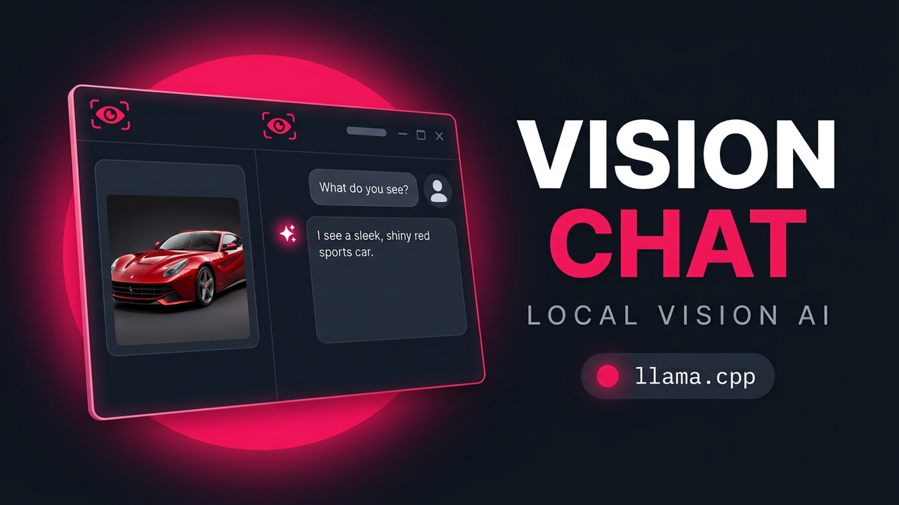

<div align="center">


**A local, stateful vision chat assistant — upload an image once, then keep asking.**

LangChain · llama.cpp · Chainlit · Session memory

[Features](#features) · [Demo Video](#demo-video) · [Getting started](#getting-started) · [Configuration](#configuration) · [How it works](#how-it-works) · [Testing](#testing)

</div>

---

Vision Chat connects a **vision-language model** served locally by **llama.cpp** to a **Chainlit** web UI through **LangChain**. You upload an image once, ask questions about it, and the conversation remembers — follow-up questions are answered in the context of the image and everything discussed so far. Starting a new chat means a new conversation about a new image.

Everything runs on your machine: the model server, the web UI, and the conversation memory.

## Features

- **Upload once, ask many** — the image is embedded in the first message of a session and stays in context for every follow-up
- **Streaming answers** — responses stream token-by-token into the UI (with an automatic non-streaming fallback)
- **Thinking / reasoning display** — if the model emits reasoning content (llama.cpp `reasoning_content`), it streams into a separate collapsible _Thinking_ step; never faked when the model doesn't provide it
- **Session-based memory** — per-session history via `RunnableWithMessageHistory` + `InMemoryChatMessageHistory`
- **Clean separation** — UI logic (`app.py`) contains zero LangChain details; all chat logic lives in the reusable `vision_chat` package
- **Model-free development mode** — a stateless mock of llama.cpp's OpenAI protocol lets you run the whole stack without downloading a model
- **Optional LangSmith tracing** — flip two environment variables to trace every run

## **Demo Video**

Watch the full demonstration on YouTube:

[](https://youtu.be/Lx-c-1EgXMs)

## Tech stack

| Layer           | Technology                                                                                        |
| --------------- | ------------------------------------------------------------------------------------------------- |
| Web UI + server | [Chainlit](https://github.com/Chainlit/chainlit)                                                  |
| Orchestration   | [LangChain](https://github.com/langchain-ai/langchain) (`RunnableWithMessageHistory`)             |
| Model client    | [langchain-openai](https://github.com/langchain-ai/langchain) (OpenAI-compatible)                 |
| Model runtime   | [llama.cpp](https://github.com/ggml-org/llama.cpp) (`llama serve`, OpenAI API)                    |
| Vision model    | Qwen3-VL-2B-Instruct (GGUF) — other llama.cpp-compatible multimodal GGUF models can be configured |
| Configuration   | `pydantic-settings` + `.env`                                                                      |
| Tooling         | [uv](https://docs.astral.sh/uv/), Make, pytest                                                    |

## Project structure

```text
Vision-Chat/
├── .chainlit/
│   └── config.toml           # Chainlit settings and branding
├── assets/
│   └── red_car.jpg           # Sample image
├── docs/
│   └── logo_banner.png       # README banner
├── public/                   # Chainlit UI branding
│   ├── favicon.ico
│   ├── favicon.png
│   ├── logo_banner.png
│   ├── logo_dark.png
│   └── logo_light.png
├── src/vision_chat/          # Reusable chat package
│   ├── __init__.py
│   ├── chat.py               # Chat chain, memory, and streaming
│   ├── config.py             # Application settings
│   ├── images.py             # Image processing and encoding
│   ├── memory.py             # Per-session conversation history
│   └── model.py              # llama.cpp model client
├── tests/                    # Automated tests
│   ├── __init__.py
│   ├── test_app.py
│   └── test_chat.py
├── tools/                    # Development and E2E tools
│   ├── e2e_ws.py             # WebSocket end-to-end test
│   └── mock_llama_server.py  # Mock llama.cpp server
├── app.py                    # Chainlit application
├── chainlit.md               # Chainlit welcome screen
├── .env.example              # Environment configuration template
├── .gitignore
├── Makefile                  # Development commands
├── pyproject.toml            # Project metadata and dependencies
├── README.md
└── uv.lock                   # Locked dependencies
```

## Getting started

**Requirements:** Python 3.11+ and (for real inference) [llama.cpp](https://github.com/ggml-org/llama.cpp).

### 1. Install the tools

```bash
make install-uv      # installs uv
make install-llama   # installs llama.cpp -> ~/.llama-app/llama
```

### 2. Install dependencies

```bash
make install         # uv sync — creates .venv with everything
```

### 3. Start the model server

```bash
make serve           # downloads & serves Qwen3-VL-2B-Instruct-GGUF
```

> The model must be **multimodal** (image-capable). Text-only models will ignore the image.

### 4. Open the UI

```bash
make ui              # Chainlit on http://localhost:8000
```

Upload `assets/red_car.jpg` (or any image) when prompted and start asking. A session might look like:

```text
You:  What do you see?
AI:   I see a red car parked on a residential street.

You:  What color is it?
AI:   The car is red.

You:  Does it have any visible damage?
AI:   There is a dent on the front door.
```

Use **+ New Chat** to start a conversation about a different image.

### No model? Try the mock

```bash
make mock-server     # terminal 1 — fake llama.cpp server
make ui              # terminal 2 — web UI on :8000
```

The mock speaks llama.cpp's OpenAI protocol (including SSE streaming and `reasoning_content`), so the entire stack works without any model download. To make streaming slow enough to watch:

```bash
uv run python tools/mock_llama_server.py --delay-ms 150
```

## Configuration

Copy the template and edit as needed — every value has a working default:

```bash
cp .env.example .env
```

| Variable                                   | Default                                           | Used by                                                                             |
| ------------------------------------------ | ------------------------------------------------- | ----------------------------------------------------------------------------------- |
| `MODEL_NAME`                               | `Qwen3-VL-2B-Instruct`                            | app — model id sent with each request                                               |
| `LLAMA_BASE_URL`                           | `http://127.0.0.1:8081/v1`                        | app — llama.cpp endpoint; `make serve`/`mock-server` derive their host/port from it |
| `LLAMA_API_KEY`                            | `sk-no-key-required`                              | app — llama.cpp ignores it; the OpenAI client requires one                          |
| `MAX_TOKENS`                               | `256`                                             | app — reply length cap                                                              |
| `HOST` / `PORT`                            | `0.0.0.0` / `8000`                                | `make ui` — web UI bind address                                                     |
| `MODEL_REPO`                               | `Qwen/Qwen3-VL-2B-Instruct-GGUF`                  | `make serve` — Hugging Face repo to download                                        |
| `LANGSMITH_TRACING` / `LANGSMITH_API_KEY`  | off / empty                                       | app — LangSmith tracing (needs both set)                                            |
| `LANGSMITH_PROJECT` / `LANGSMITH_ENDPOINT` | `vision-chat` / `https://api.smith.langchain.com` | app — LangSmith destination                                                         |

Inspect the effective configuration any time with `make config`.

## How it works

```text
Browser (Chainlit UI)
      │  upload image once, then chat
      ▼
app.py ── calls ──> src/vision_chat/chat.py
                      prompt ──> chain ──> RunnableWithMessageHistory
                                                │  full history resent each turn
                                                ▼
                                      LlamaChatOpenAI (langchain-openai)
                                                │  OpenAI-compatible HTTP (SSE)
                                                ▼
                                      llama.cpp  (llama serve)
```

- **First turn:** the image file is read and embedded as a base64 data URL inside the first user message.
- **Every turn:** `RunnableWithMessageHistory` loads the session history and passes it to the chat chain. Because llama.cpp is stateless, the full message history — including the image from the first turn — is sent with each request.
- **Streaming:** `chat.astream()` yields tokens; reasoning deltas (`reasoning_content`) are preserved by a small `ChatOpenAI` subclass and routed to a collapsible _Thinking_ step, while answer tokens stream into the chat message.
- **New image = new session:** starting a new chat generates a fresh session id and an empty history, so conversations never mix.
- **Failure safety:** if streaming fails, the app retries the turn as a single non-streaming request; a failed stream writes nothing to history, so the retry starts clean.

## Testing

```bash
make test        # uv run pytest
```

The suite needs **no running server and no model**: chat-logic tests run against fake models, and Chainlit lifecycle tests use mocks. There is also a manual end-to-end check that drives the real server over a websocket (upload → question → streamed answer → thinking step):

```bash
uv run python tools/e2e_ws.py    # while make ui + make mock-server are running
```

## Limitations

- **In-memory state** — sessions are lost on restart; nothing is persisted
- **Single-user by design** — no auth, no concurrency hardening
- **Reasoning display** depends on the model + `--reasoning-format` server flag; without it you simply get the answer

## License

MIT

---


